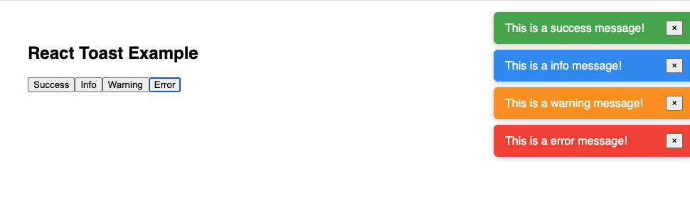

# React Toast Notification System

A customizable toast notification component built with React that supports multiple positions, animations, and auto-dismiss functionality.



## Features

- **Multiple Positions**: `top-left`, `top-right`, `bottom-left`, `bottom-right`
- **Three Animation Types**: `fade`, `slide`, `pop`
- **Auto Dismiss**: Configurable duration with manual close option
- **Toast Types**: `success`, `info`, `warning`, `error` with color coding
- **Smart Stacking**: Bottom positions stack from bottom to top
- **Global API**: Trigger toasts from anywhere in your app

## Quick Start

```javascript
import { showToast } from "./ToastContainer";

// Show a toast
showToast({
  type: "success",
  message: "Operation completed successfully!",
  duration: 3000,
  position: "top-right",
  animation: "pop",
});
```

## Component Structure

```
├── Toast.js          # Individual toast component
├── ToastContainer.js  # Toast manager & global API
├── Toast.css         # All styling & animations
└── App.js            # Usage example
```

## Toast Configuration

| Property  | Type   | Options                                                | Default     |
| --------- | ------ | ------------------------------------------------------ | ----------- |
| type      | string | `success`, `info`, `warning`, `error`                  | `info`      |
| message   | string | Any text content                                       | Required    |
| duration  | number | Milliseconds (e.g., 3000 = 3 seconds)                  | 3000        |
| position  | string | `top-left`, `top-right`, `bottom-left`, `bottom-right` | `top-right` |
| animation | string | `fade`, `slide`, `pop`                                 | `fade`      |

## Animation Details

- **Fade**: Smooth opacity transition with slight upward movement
- **Slide**: Slides in from the side (right for right positions, left for left positions)
- **Pop**: Bouncy scale animation that starts small and briefly overshoots

## Position Behavior

- **Top positions**: New toasts appear at the top, pushing older ones down
- **Bottom positions**: New toasts appear at the bottom, pushing older ones up
- All toasts in a session use the same position (determined by the first toast)

## How It Works

1. **Global Function**: `showToast()` can be called from anywhere
2. **State Management**: `ToastContainer` manages all active toasts
3. **Auto Cleanup**: Each toast auto-removes after its duration
4. **Manual Close**: Users can click the × button to dismiss early
5. **Position Sync**: All toasts use the same position for consistency

## Usage Examples

```javascript
// Success notification
showToast({
  type: "success",
  message: "File uploaded successfully!",
  duration: 4000,
  position: "bottom-right",
  animation: "slide",
});

// Error with longer duration
showToast({
  type: "error",
  message: "Failed to save changes. Please try again.",
  duration: 5000,
  position: "top-left",
  animation: "pop",
});

// Quick info message
showToast({
  type: "info",
  message: "New update available",
  duration: 2000,
  animation: "fade",
});
```

## Implementation Notes

- Uses React hooks (`useState`, `useEffect`) for state management
- CSS animations with `@keyframes` for smooth transitions
- Flexbox layout for responsive positioning
- Unique timestamp IDs for toast tracking
- Global function pattern for external API access

Perfect for notifications, alerts, confirmations, and user feedback in React applications!
